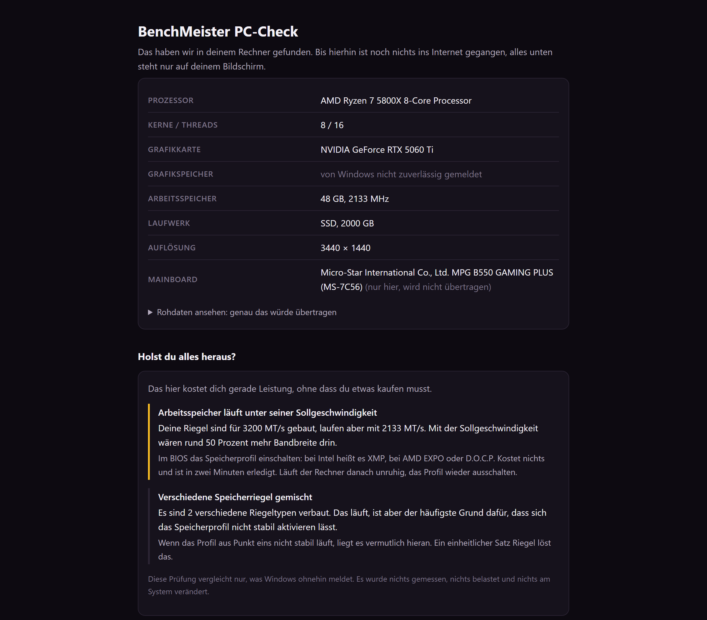

# BenchMeister PC-Check

Kleines Windows-Programm, das ausliest, welche Hardware in einem Rechner
steckt, und das Ergebnis auf [benchmeister.de](https://benchmeister.de)
auswertet: Gesamtwertung, Vergleich mit kuratierten Komplettsystemen und
Hinweise, wo sich Aufrüsten lohnt.

Keine Installation. Eine Datei, Doppelklick, danach kann man sie löschen.

**[⬇ Download der aktuellen Fassung](https://github.com/Dominic-Lutz85/benchmeister-pc-check/releases/latest/download/BenchMeister-PC-Check.exe)**
(Windows 10/11, ca. 9 MB, portabel). Die SHA256-Prüfsumme steht bei der
jeweiligen [Version](https://github.com/Dominic-Lutz85/benchmeister-pc-check/releases).



## English summary

A small, portable Windows tool that reads out your PC's hardware via
WMI (the same information Device Manager shows) and displays it locally
in your browser. **No network connection is made before you explicitly
consent.** It also runs a local plausibility check: RAM running below
its rated speed (XMP/EXPO off), single-channel memory, mixed memory
kits, games on an HDD, each with a one-line fix.

Optionally, with your consent, the result is uploaded to
[benchmeister.de](https://benchmeister.de) for a score and upgrade
suggestions. What gets transmitted is shown verbatim beforehand, and
never includes serial numbers, MAC addresses, usernames or any other
identifier. The source of every network call is in
[`internal/upload/client.go`](internal/upload/client.go), the only file
in this project that talks to the internet. The rest of this README is
in German, as is the website.

## Warum dieser Quelltext offen ist

Dieses Programm bittet darum, eine fremde ausführbare Datei zu starten,
und es überträgt (nach Zustimmung) Daten. Bei so etwas ist
"vertrau uns" kein Argument. Deshalb kann hier jede:r nachlesen, was
tatsächlich passiert, und das Programm selbst aus dem Quelltext bauen,
statt der fertigen Datei zu vertrauen.

Die BenchMeister-Website selbst liegt in einem eigenen, privaten
Repository. Offen ist genau das, was auf fremden Rechnern läuft.

## Was das Programm tut

1. Fragt Windows über WMI nach der verbauten Hardware. Dieselbe Auskunft,
   die auch der Geräte-Manager anzeigt.
2. Prüft lokal auf verschenkte Leistung: Arbeitsspeicher unter seiner
   Sollgeschwindigkeit (XMP/EXPO aus), einzelner Riegel statt
   Doppelbestückung, gemischte Kits, Spiele auf einer HDD. Jeder Befund
   mit einem Satz, was zu tun ist. Es wird nichts gemessen, nichts
   belastet und nichts am System verändert, verglichen wird nur, was
   Windows ohnehin meldet.
3. Zeigt das Ergebnis lokal im Standardbrowser an, inklusive der Rohdaten,
   die übertragen würden. **Bis hierhin gibt es keinerlei Netzwerkverkehr.**
4. Fragt zwei getrennte Einwilligungen ab, beide standardmäßig leer.
5. Überträgt die Daten nur nach ausdrücklicher Zustimmung und öffnet die
   Ergebnisseite.

## Was das Programm ausdrücklich nicht tut

- nichts installieren, keine Registry-Einträge, kein Autostart, kein
  Dienst im Hintergrund
- keine Administratorrechte anfordern
- keine Belastungstests fahren (kein Hochtakten, keine Volllast)
- **vor der Zustimmung keine einzige Netzwerkverbindung aufbauen**

Der letzte Punkt lässt sich mit einer Firewall nachprüfen, und dazu wird
ausdrücklich eingeladen.

### Ein Wert wird aus der Registry gelesen

Der Vollständigkeit halber, weil oben "keine Registry-Einträge" steht und
das eine Zusage über das Schreiben ist: Seit 1.0.6 wird **ein** Wert aus
der Registry **gelesen**, und zwar

```
HKLM\SYSTEM\CurrentControlSet\Control\Class\{4d36e968-e325-11ce-bfc1-08002be10318}\<NNNN>
    DriverDesc                        (Name der Grafikkarte)
    HardwareInformation.qwMemorySize  (Größe des Grafikspeichers)
```

Grund: `Win32_VideoController.AdapterRAM` ist ein 32-Bit-Feld und kann
keine 4 GB fassen. Jede halbwegs aktuelle Karte meldet dort deshalb
Unsinn, und das Programm schrieb bis dahin "von Windows nicht
zuverlässig gemeldet", auch bei einer Karte mit 16 GB. Der Treiber legt
die richtige Größe daneben in seinem eigenen Schlüssel ab.

Es wird nichts angelegt, nichts geändert und nichts gelöscht.
Administratorrechte braucht es dafür nicht. Der Code steht in
`internal/scan/scan.go`, Funktion `grafikspeicherAusRegistry`.

## Welche Daten erfasst werden

| Erfasst | Nicht erfasst |
|---|---|
| Prozessor-Modell, Kerne, Threads | Seriennummern (Festplatte, Mainboard) |
| Grafikkarten-Modell, Speicher | MAC-Adresse, BIOS-Kennung |
| Arbeitsspeicher: Größe, Takt | Windows-Benutzername, Rechnername |
| Laufwerk: SSD/HDD, Größe | Installierte Programme, Dateien |
| Bildschirmauflösung | IP-Adresse |

Die verbindliche Liste steht in
[`internal/scan/types.go`](internal/scan/types.go). Was übertragen wird,
steht in [`internal/upload/client.go`](internal/upload/client.go), der
einzigen Datei im Projekt, die überhaupt eine Netzwerkverbindung nach
außen aufbaut.

Das Mainboard wird ausgelesen und lokal angezeigt, aber **nicht**
übertragen.

Aus einem übertragenen Ergebnis lässt sich weder eine Person noch ein
bestimmter Rechner wiedererkennen.

### Zur IP-Adresse

Damit die Tabelle oben nicht mehr verspricht, als sie halten kann: Das
Programm liest die IP-Adresse nicht aus und sendet sie nicht mit. Aber
jede Verbindung ins Internet trägt sie zwangsläufig, das gilt für jede
Website und auch hier.

Seit 1.0.3 verrechnet der Server von benchmeister.de sie kurz im
Arbeitsspeicher zu einer Prüfsumme, um zu begrenzen, wie viele
Ergebnisse in kurzer Zeit von derselben Stelle ankommen. Ohne diese
Bremse könnte jemand die Statistik mit erfundenen Rechnern fluten, und
eine Statistik, die jeder fälschen kann, ist wertlos. Die Adresse wird
dabei nicht gespeichert, nicht protokolliert und landet in keiner
Datenbank. Nach zehn Minuten ist auch die Prüfsumme weg.

Details in [Abschnitt 3g der
Datenschutzerklärung](https://benchmeister.de/datenschutz).

## Die zwei Einwilligungen

Bewusst getrennt, beide standardmäßig leer:

- **(a) Ergebnis ansehen.** Nötig, damit die Daten überhaupt hochgeladen
  werden und die Auswertung angezeigt werden kann.
- **(b) Für Marktforschung freigeben.** Freiwillig und unabhängig davon.
  Erlaubt, die anonymen Angaben in eine Gesamtstatistik einfließen zu
  lassen, die an Hersteller und Händler weitergegeben werden kann. Damit
  finanziert sich BenchMeister mit.

**Wer nur seinen eigenen Score sehen will, muss (b) nie zustimmen.**

Ohne (a) wird gar nichts gesendet, und das ist an drei Stellen
abgesichert: in der Oberfläche, im lokalen Server
([`internal/ui/server.go`](internal/ui/server.go)) und in der Datenbank
selbst, die einen Upload ohne diese Einwilligung ablehnt.

Details siehe [Datenschutzerklärung](https://benchmeister.de/datenschutz),
Abschnitt 3d.

## Selbst bauen

Voraussetzung: [Go](https://go.dev/dl/) ab Version 1.21.

```
go build -ldflags="-s -w" -o BenchMeister-PC-Check.exe .
```

Ergibt eine eigenständige Datei von etwa 9 MB, ohne weitere
Abhängigkeiten.

## Hinweis zur Windows-Warnung

Die veröffentlichte Datei ist nicht signiert, deshalb zeigt Windows beim
ersten Start eine Warnung mit "Unbekannter Herausgeber". Grund: Ein
Signaturzertifikat kostet mehrere hundert Euro pro Jahr, und BenchMeister
hat bisher keinen Umsatz. Das wird nachgeholt, sobald es sich trägt.

Wem das zu unsicher ist: Der Quelltext liegt hier, das Programm lässt sich
mit dem Befehl oben in wenigen Sekunden selbst bauen.

## Aufbau

```
main.go                    Ablauf: auslesen, anzeigen, ggf. senden
internal/scan/types.go     Abschließende Liste der erfassten Felder
internal/scan/scan.go      WMI-Abfragen
internal/pruefung/         Plausibilitätsprüfung (läuft komplett lokal)
internal/ui/server.go      Lokale Anzeige (nur 127.0.0.1) und Zustimmung
internal/ui/assets/        Die HTML-Seite, die im Browser erscheint
internal/upload/client.go  Der einzige Netzwerkaufruf nach außen
```

## Lizenz

MIT
